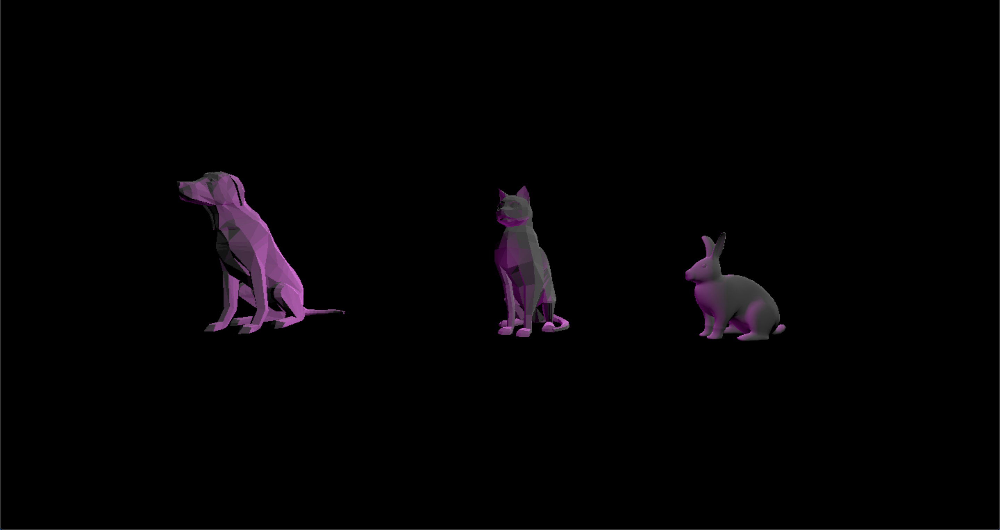

# CMPM163Labs
lab3: https://drive.google.com/file/d/1zXYlh6g8A_hYIIJxuvV1UadZ0YkqL02M/view?usp=sharing

Cube1:
    - my fragment shader made with interpolation  0xABFFCC 0xFFC0CB
    
Cube2:
    - A cube with a green specular highlight made with three.js phong material
    
Cube3/4:
    -The top and bottom cubes made with a normal material 
    
Cube5:
    -fragment shader made with interpolation  0xACB6E5 0x74ebd5
    

lab2: https://drive.google.com/file/d/1um7rsxItelPrQJbGDyNUcufro9Pta85l/view?usp=sharing

