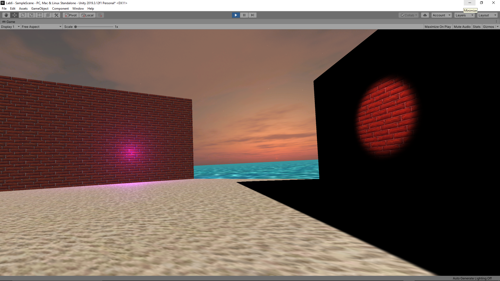
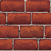

# CMPM163Labs
**lab6:**
part1:
ScreenShot: 

Light Definitions:
    - point:
        - simulates rays shining out from one infinitely small point in space.

    - spot:
        - a lamp projecting a narrow, intense beam of light directly on to a place or person, especially a performer on stage.

    - directional:
        -  lighting that travels in a specific direction that highlights a specific object or work surface.

    - area:
        - a light that casts directional light rays from within a set boundary, either a rectangle or circle

Two Textured Objects:
    - A brick wall:
    - used a diffuse material and brick repeating pattern to make a brick wall.
    

    - Sand:
    - used a diffuse material with a sand repeating pattern to make sand.
    

Skybox:
    - a skybox of a sun set.

**lab5:**

Part 1 Unity Video: 
- video link: https://drive.google.com/file/d/1Mgkkc54P_2yrHORn6RATcaNfAG4zAf0Y/view?usp=sharing
- made different color paritcles and some game modifications (i.e. professor cubes, more paritcles, world color)
	- Made the cubes by adding a primitive cube to the world and texturing it with a image
	- Duplicated and modified the partcle from the tutorial
	- changed the intensity and color of the overall light
	- also changed and made the song playing as background music
	
Part 2 Particles:
- Moving around the static paritcles: https://drive.google.com/file/d/1hjAm-FRq2t2ZRm_zjWI95OsXueBM4zr1/view?usp=sharing
- Explosion paritcles: https://drive.google.com/file/d/1je5qpaSQKNmpu7j7OpoJKYPr5vxdsw8O/view?usp=sharing
- Custom Breathing Particle Effect: https://drive.google.com/file/d/1wtlgmZdiv7mG_RDfibBRTbTka8Z2ABCE/view?usp=sharing
	- made by making an offset variable and reseting the position by alternating adding and subtracting of position and velocity vectors.
	- also added color changing hue and texture from the previouse parts.
	
**lab4:**
video link: https://drive.google.com/file/d/1QkUAiWr50jjeJyz0P6A5Ej4OMn59Bh6E/view?usp=sharing

cube 1:
- built in three.js texture, flat texture with no normal map, grass texture on far left

cube 2:
- built in three.js texture, texture with matching normal map, grass texture in middle

cube 3:
- built in three.js texture with a different pair of texture and normal map, brick texture.

cube 4:
- texture loaded with shader from following the lab, with metal texture.

cube 5:
- tile texture made by performing claculations in the fragment shader.
- I solved this by creating a new vec 2 that was almost double the vUv vec2 and then performed a modulus operation on both the x and y parts of the new vector by 1.0.

**Questions from Lab:**

a) What is the formula given a u value of the uv coordinate (a value between 0 and 1), I get the x value of the pixel to sample from in this 8x8 texture?
    
    - x = 7u
    
b) What is the formula given a v value of the uv coordinate (a value between 0 and 1), I get the y value of the pixel to sample from in this 8x8 texture?
    
    - y = 7v
    
c) What color is sampled from the texture at the uv coordinate (0.375, 0.25)? (sample from the image based on the number your formula gives you i.e. (1, 0) is blue)
    
    - The color is grey.

**lab3:** https://drive.google.com/file/d/1zXYlh6g8A_hYIIJxuvV1UadZ0YkqL02M/view?usp=sharing

Cube1:
    - my fragment shader made with interpolation  0xABFFCC 0xFFC0CB
    
Cube2:
    - A cube with a green specular highlight made with three.js phong material
    
Cube3/4:
    -The top and bottom cubes made with a normal material 
    
Cube5:
    -fragment shader made with interpolation  0xACB6E5 0x74ebd5
    

**lab2:** https://drive.google.com/file/d/1um7rsxItelPrQJbGDyNUcufro9Pta85l/view?usp=sharing

